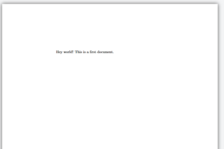
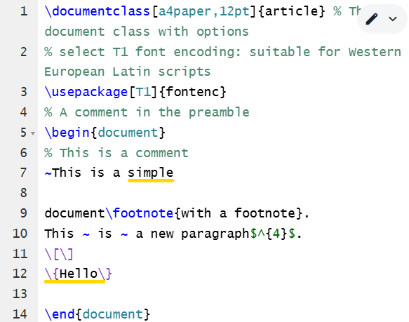
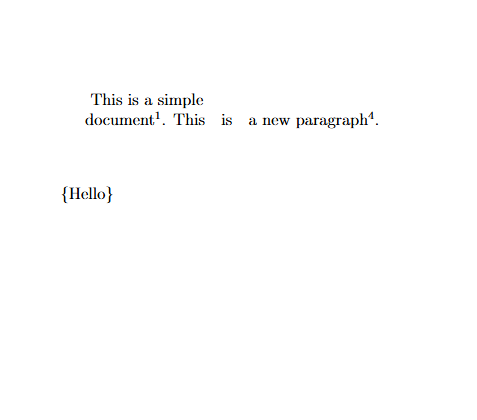

---
## Front matter
lang: ru-RU
title: Практикум по научному письму
author: Колчева Юлия Вячеславовна
institute: РУДН, Москва, Россия

date: 27 Сентября 2025

## Formatting
## i18n babel
babel-lang: russian
babel-otherlangs: english

## Formatting pdf
toc: false
toc-title: Содержание
slide_level: 2
aspectratio: 169
section-titles: true
theme: metropolis
header-includes:
 - \metroset{progressbar=frametitle,sectionpage=progressbar,numbering=fraction}

---

# Лабораторная работа 2

## LaTeX

{ #fig:001 width=70% }

## Работа программы

{ #fig:002 width=70% }

## LaTeX

{ #fig:003 width=70% }

## Работа программы

{ #fig:004 width=70% }

## Выводы

- Познакомилась с языком LaTeX и освоила основные команды.

## {.standout}

Спасибо за внимание!
