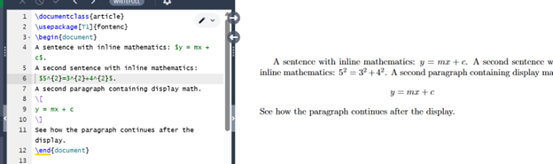
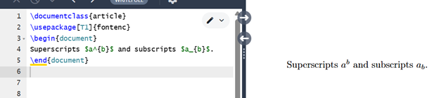
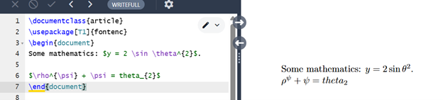
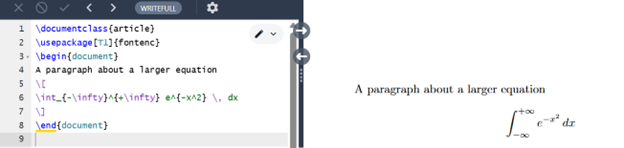
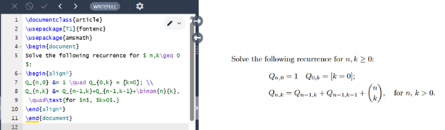
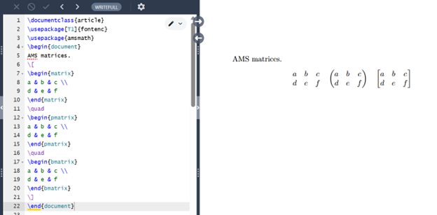
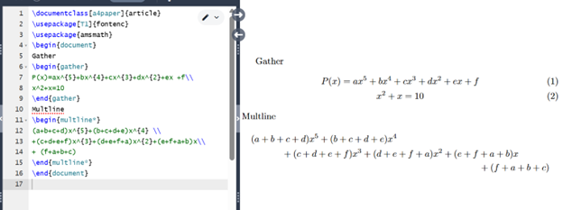
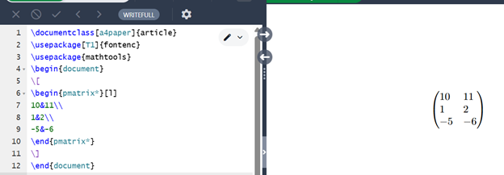

---
# Front matter
lang: ru-RU
title: "Лабораторная работа №3"
subtitle: "Практикум по научному письму"
author: "Колчева Юлия Вячеславовна"

## Generic otions
lang: ru-RU
toc-title: "Содержание"

## Bibliography
bibliography: cite.bib
csl: pandoc/csl/gost-r-7-0-5-2008-numeric.csl
link-citations: true

## Pdf output format
toc: true # Table of contents
toc-depth: 2
lof: true # List of figures
lot: true # List of tables
fontsize: 12pt
linestretch: 1.5
papersize: a4
documentclass: scrreprt

## I18n babel
babel-lang: russian
babel-otherlangs: english
## Fonts
## Критически важные настройки для русского языка
mainfont: IBM Plex Serif
## I18n polyglossia
## Настройки для русского языка
polyglossia-lang:
  name: russian
  options:
    - spelling=modern
    - babelshorthands=true
polyglossia-otherlangs:
  name: english

romanfont: IBM Plex Serif
sansfont: IBM Plex Sans
monofont: IBM Plex Mono
mathfont: STIX Two Math
romanfontoptions: Ligatures=Common,Ligatures=TeX,Scale=0.94
sansfontoptions: Ligatures=Common,Ligatures=TeX,Scale=MatchLowercase,Scale=0.94
monofontoptions: Scale=MatchLowercase,Scale=0.94,FakeStretch=0.9
mathfontoptions:
## Pandoc-crossref LaTeX customization
figureTitle: "Рис."
tableTitle: "Таблица"
listingTitle: "Листинг"
lofTitle: "Список иллюстраций"
lotTitle: "Список таблиц"
lolTitle: "Листинги"
## Misc options
indent: true
header-includes:
  - \usepackage{indentfirst}
  - \usepackage{float} # keep figures where there are in the text
  - \floatplacement{figure}{H} # keep figures where there are in the text
---

# Цель работы

Познакомиться с языком LaTeX, продолжить изучение его возможностей. 

# Задание

1. Запустить несколько различных программ, изучить новый пакет и команды языка.

# Выполнение лабораторной работы

 
Для начала рассмотрим как написать математическую формулу. Всё выражение нам необходимо заключить в ковычки. 

{ #fig:001 width=70% }

 
Чтобы отобразить верхний и нижний индекс нам необходимо соответственно написать знаки ^ и _ как в примере. 

{ #fig:002 width=70% }

Чтобы отобразить особые символы , используем косую черту с командой соответствующей буквы. Следуя заданию, я добавила своё выражение 

{ #fig:003 width=70% }

Чтобы отобразить интеграл, используем команду и заполняем границы интеграла как нижний и верхний индекс ранее. 

{ #fig:004 width=70% }

Отобразим более сложные команды. Здесь мы использовали новый пакет amsmath. Напишем с его помощью программу с добавлением текста в формулах.

{ #fig:005 width=70% }

При помощи этого пакета мы можем отображать матрицы в различных скобках. 

{ #fig:006 width=70% }

Теперь рассмотрим способы использования шрифтов. Мы можем отобразить текст разными способами. Здесь продемонстрировано, как я использую шрифты по отдельности и пробую совместить их. При совмещении шрифтов в моём случае ипользовался только последний внутренний шрифт. 

{ #fig:007 width=70% }

При помощи пакета amsmath мы можем пронумеровать формулы в документе, а так же задать выравнивание тексту. На скриншоте вы видите реализацию. 

{ #fig:008 width=70% }

В стандартном LaTeX есть два способа выделить жирным шрифтом математические символы. Чтобы выделить жирным шрифтом всё выражение, используем \boldmath перед вводом выражения. Команда \\mathbf также позволяет выделить отдельные буквы или слова прямым жирным шрифтом. 

{ #fig:009 width=70% }

Пакет mathtools загружает amsmath и добавляет несколько дополнительных функций, таких как варианты матричных сред amsmath, которые позволяют задавать выравнивание столбцов. Менять выравнивание можно просто меняя букву на r или l в начале команды. 

{ #fig:010 width=70% }

Небольшой пример дополнительных шрифтов. 

{ #fig:011 width=70% }

Программы работают верно. 

# Выводы

Познакомилась с языком LaTeX, продолжила изучение его возможностей.

# Список литературы

Лабораторная работа №3
Практикум по научному письму [Электронный ресурс]. URL: https://esystem.rudn.ru/pluginfile.php/2862317/mod_folder/content/0/Practical-scientific-writing.pdf

