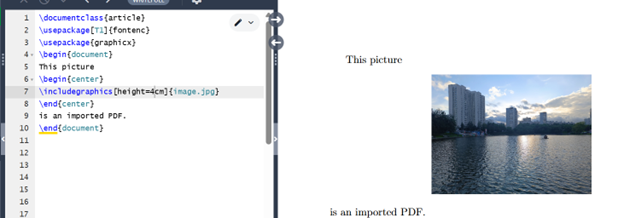
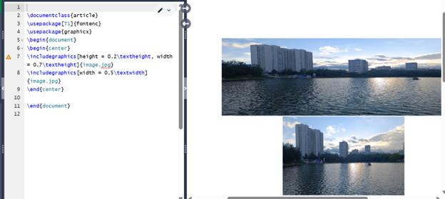
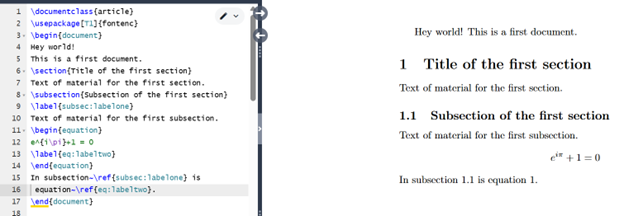
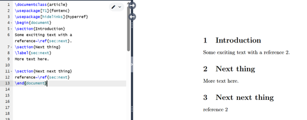

---
## Front matter
lang: ru-RU
title: Практикум по научному письму
author: Колчева Юлия Вячеславовна
institute: РУДН, Москва, Россия

date: 11 Октября 2025

## Formatting
## i18n babel
babel-lang: russian
babel-otherlangs: english

## Formatting pdf
toc: false
toc-title: Содержание
slide_level: 2
aspectratio: 169
section-titles: true
theme: metropolis
header-includes:
 - \metroset{progressbar=frametitle,sectionpage=progressbar,numbering=fraction}

---

# Лабораторная работа 4

## Изучение LaTeX

{ #fig:001 width=70% }

## Высота и ширина изображения

{ #fig:002 width=70% }

## Высота и ширина изображения

{ #fig:003 width=70% }

## Изображения в тексте

{ #fig:004 width=70% }

## Плавающее окружение

{ #fig:005 width=70% }

## Плавающее окружение

{ #fig:006 width=70% }

## Ссылка

{ #fig:007 width=70% }

## Гиперссылка

{ #fig:008 width=70% }

## Выводы

- Познакомилась с LaTeX
- Изучила новый пакет
- Научилась оставлять ссылки в тексте

## {.standout}

Спасибо за внимание!
