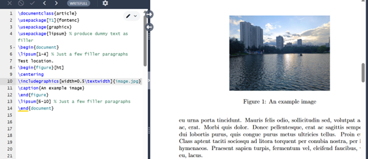
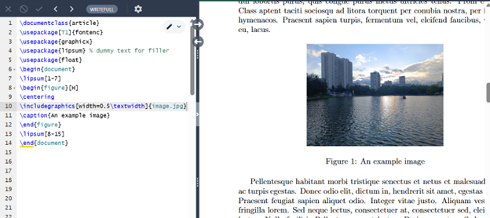
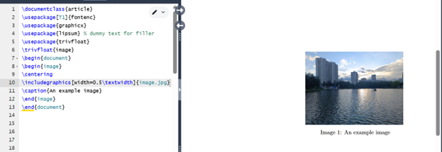

---
# Front matter
lang: ru-RU
title: "Лабораторная работа №4"
subtitle: "Практикум по научному письму"
author: "Колчева Юлия Вячеславовна"

## Generic otions
lang: ru-RU
toc-title: "Содержание"

## Bibliography
bibliography: cite.bib
csl: pandoc/csl/gost-r-7-0-5-2008-numeric.csl

## Pdf output format
fontsize: 12pt
linestretch: 1.5
papersize: a4
documentclass: scrreprt
## I18n polyglossia
polyglossia-lang:
  name: russian
  options:
	- spelling=modern
	- babelshorthands=true
polyglossia-otherlangs:
  name: english
## I18n babel
babel-lang: russian
babel-otherlangs: english
## Fonts
mainfont: IBM Plex Serif
romanfont: IBM Plex Serif
sansfont: IBM Plex Sans
monofont: IBM Plex Mono
mathfont: STIX Two Math
mainfontoptions: Ligatures=Common,Ligatures=TeX,Scale=0.94
romanfontoptions: Ligatures=Common,Ligatures=TeX,Scale=0.94
sansfontoptions: Ligatures=Common,Ligatures=TeX,Scale=MatchLowercase,Scale=0.94
monofontoptions: Scale=MatchLowercase,Scale=0.94,FakeStretch=0.9
mathfontoptions:
## Biblatex
biblatex: true
biblio-style: "gost-numeric"
biblatexoptions:
  - parentracker=true
  - backend=biber
  - hyperref=auto
  - language=auto
  - autolang=other*
  - citestyle=gost-numeric
## Pandoc-crossref LaTeX customization
figureTitle: "Рис."
listingTitle: "Листинг"
lofTitle: "Список иллюстраций"
lolTitle: "Листинги"
## Misc options
indent: true
header-includes:
  - \usepackage{indentfirst}
  - \usepackage{float} # keep figures where there are in the text
  - \floatplacement{figure}{H} # keep figures where there are in the text
---

# Цель работы

Познакомиться с языком LaTeX, продолжить изучение его возможностей. 

# Задание

1. Запустить несколько различных программ, изучить новый пакет для работы с графикой и новые команды языка.

# Выполнение лабораторной работы

 
Начинаем работать с новым пакетом. Чтобы добавить графику из внешнего источника в LaTeX, используем пакет graphicx, который добавляет в LaTeX команду \\includegraphics. 

{ #fig:001 width=70% }

 
Попробуем поменять высоту и ширину изображения. LaTeX автоматически масштабирует изображение, чтобы сохранить соотношение сторон. 

{ #fig:002 width=70% }

Мы можем не только менять ширину и высоку изображения, но и обрезать его, а так же переворачивать под разными углами. 

{ #fig:003 width=70% }

Графические элементы могут перемещаться в другое место документа. Это называется плавающим элементом. Попробуем реализовать это в программе 

{ #fig:004 width=70% }

Часто требуется, чтобы рисунок отображался в выводе именно там, где он находится во входных данных. Пакет float позволяет это сделать при помощи опции H. 

{ #fig:005 width=70% }

Если нам необходимо несколько сред, это можно сделать с помощью пакета trivfloat. Он предоставляет единую команду \\trivfloat для создания новых типов плавающей среды 

{ #fig:006 width=70% }

Чтобы LaTeX запомнил место в документе, нужно пометить его, а затем ссылаться на него в других местах. 

{ #fig:007 width=70% }

Превратим перекрестные ссылки в гиперссылки с помощью пакета hyperref. Стоит заметить, что если мы укажем ссылку вне главы, то отображаться и работать она не будет. 

{ #fig:008 width=70% }

Программы работают верно. 

# Выводы

Познакомилась с языком LaTeX, продолжила изучение его возможностей.

# Список литературы

Лабораторная работа №4
Практикум по научному письму [Электронный ресурс]. URL: https://esystem.rudn.ru/pluginfile.php/2862317/mod_folder/content/0/Practical-scientific-writing.pdf

