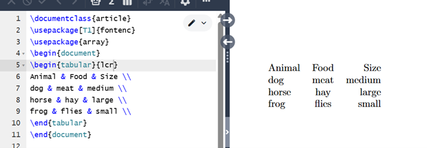
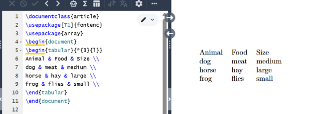
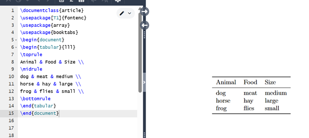
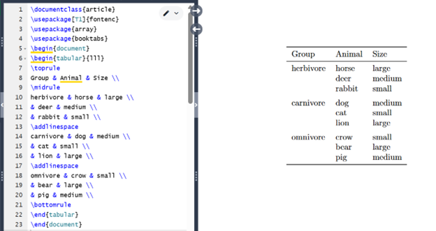
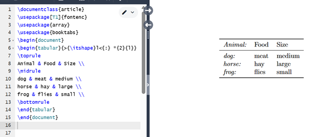
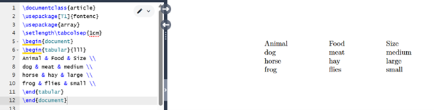
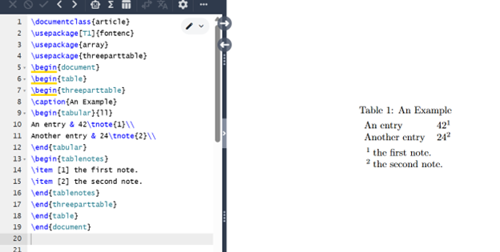
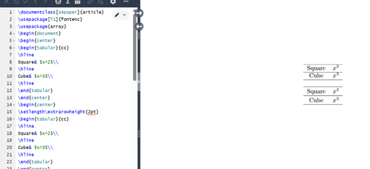

---
# Front matter
lang: ru-RU
title: "Лабораторная работа №5"
subtitle: "Практикум по научному письму"
author: "Колчева Юлия Вячеславовна"

## Generic otions
lang: ru-RU
toc-title: "Содержание"

## Bibliography
bibliography: cite.bib
csl: pandoc/csl/gost-r-7-0-5-2008-numeric.csl

## Pdf output format
fontsize: 12pt
linestretch: 1.5
papersize: a4
documentclass: scrreprt
## I18n polyglossia
polyglossia-lang:
  name: russian
  options:
	- spelling=modern
	- babelshorthands=true
polyglossia-otherlangs:
  name: english
## I18n babel
babel-lang: russian
babel-otherlangs: english
## Fonts
mainfont: IBM Plex Serif
romanfont: IBM Plex Serif
sansfont: IBM Plex Sans
monofont: IBM Plex Mono
mathfont: STIX Two Math
mainfontoptions: Ligatures=Common,Ligatures=TeX,Scale=0.94
romanfontoptions: Ligatures=Common,Ligatures=TeX,Scale=0.94
sansfontoptions: Ligatures=Common,Ligatures=TeX,Scale=MatchLowercase,Scale=0.94
monofontoptions: Scale=MatchLowercase,Scale=0.94,FakeStretch=0.9
mathfontoptions:
## Biblatex
biblatex: true
biblio-style: "gost-numeric"
biblatexoptions:
  - parentracker=true
  - backend=biber
  - hyperref=auto
  - language=auto
  - autolang=other*
  - citestyle=gost-numeric
## Pandoc-crossref LaTeX customization
figureTitle: "Рис."
listingTitle: "Листинг"
lofTitle: "Список иллюстраций"
lolTitle: "Листинги"
## Misc options
indent: true
header-includes:
  - \usepackage{indentfirst}
  - \usepackage{float} # keep figures where there are in the text
  - \floatplacement{figure}{H} # keep figures where there are in the text
---

# Цель работы

Познакомиться с языком LaTeX, продолжить изучение его возможностей. 

# Задание

1. Запустить несколько различных программ, изучить новый пакет для работы с графикой и новые команды языка.

# Выполнение лабораторной работы

 
Начинаем работать с новым пакетом. Мы будем изучать пакет arrey для работы с таблицами (рис. [-@fig:001] ) 

{ #fig:001 width=70% }

 
Если в столбце таблицы много текста, у нас могут возникнуть проблемы с его корректным отображением с помощью только l, c и r. Посмотрим, что происходит в следующем примере: (рис. [-@fig:002] ) Как можно заметить, текст не отображается полностью и уходит за пределы листа.

{ #fig:002 width=70% }

Чтобы решить эту проблему, можно использовать столбец типа p. Его содержимое размещается в виде абзацев с указанной вами шириной. (рис. [-@fig:003] ) 

{ #fig:003 width=70% }

Если в вашей таблице много столбцов одного типа, то указывать такое количество определений столбцов в преамбуле неудобно. Можно упростить задачу, используя {num}{string} (рис. [-@fig:004] ) 

{ #fig:004 width=70% }

Пакет booktabs предоставляет четыре различных типа линий. Каждую из этих команд нужно использовать в начале строки или после другой команды. Вот три команды для создания линий: toprule, midrule и bottomrule. Из их названий должно быть понятно, где их следует использовать: (рис. [-@fig:005] ) 

{ #fig:005 width=70% }

Четвёртая команда, предоставляемая пакетом booktabs, cmidrule. Её можно использовать для создания правила, которое будет занимать не всю ширину таблицы, а только указанный диапазон столбцов. (рис. [-@fig:006] ) 

{ #fig:006 width=70% }

В LaTeX можно объединить ячейки по горизонтали с помощью команды multicolumn. (рис. [-@fig:007] ) 

{ #fig:007 width=70% }

Вертикальное объединение ячеек не поддерживается в LaTeX. Обычно достаточно оставить ячейки пустыми, чтобы читатель понял, что имелось в виду, без необходимости явно объединять ячейки в строки. (рис. [-@fig:008] )

{ #fig:008 width=70% }

Поскольку > и < можно использовать для добавления элементов до и после содержимого ячейки в столбце, можем использовать их для добавления команд, которые влияют на внешний вид столбца. Например, если хотим выделить первый столбец курсивом и поставить после него двоеточие:  (рис. [-@fig:009] )

{ #fig:009 width=70% }

Обычно LaTeX добавляет немного свободного пространства с обеих сторон каждого столбца, чтобы сбалансировать внешний вид и разделить столбцы. Это пространство определяется длиной tabcolsep. (рис. [-@fig:010] )

{ #fig:010 width=70% }

Иногда приходится использовать вертикальные линии. (рис. [-@fig:011] )

{ #fig:011 width=70% }

Среда tabular принимает дополнительный аргумент width, указывающий на общую ширину таблицы. Для таблицы необходимо добавить растягивающийся пробел с помощью команды extracolsep. (рис. [-@fig:012] )

{ #fig:012 width=70% }

Таблицы образуют неразрывную рамку, поэтому они должны быть достаточно компактными, чтобы уместиться на одной странице. Часто их размещают в плавающей таблице. Несколько пакетов предоставляют варианты с похожим синтаксисом, которые позволяют разбивать таблицу на страницы.  (рис. [-@fig:013] )

{ #fig:013 width=70% }

Пакет threeparttable упрощает разметку таблиц со сносками, позволяя размещать примечания в блоке той же ширины, что и таблица.  (рис. [-@fig:014] )

{ #fig:014 width=70% }

В следующем примере демонстрируется использование параметра extrarowheight. (рис. [-@fig:015] )

{ #fig:015 width=70% }

Программы работают верно. 

# Выводы

Познакомилась с языком LaTeX, продолжила изучение его возможностей.

# Список литературы

Лабораторная работа №5
Практикум по научному письму [Электронный ресурс]. URL: https://esystem.rudn.ru/pluginfile.php/2862317/mod_folder/content/0/Practical-scientific-writing.pdf

