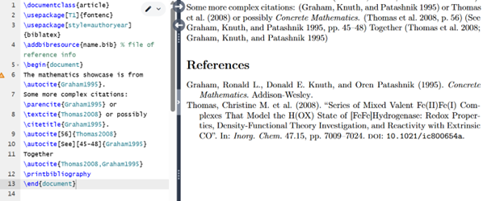

---
# Front matter
lang: ru-RU
title: "Лабораторная работа №6"
subtitle: "Практикум по научному письму"
author: "Колчева Юлия Вячеславовна"

## Generic otions
lang: ru-RU
toc-title: "Содержание"

## Bibliography
bibliography: cite.bib
csl: pandoc/csl/gost-r-7-0-5-2008-numeric.csl

## Pdf output format
fontsize: 12pt
linestretch: 1.5
papersize: a4
documentclass: scrreprt
## I18n polyglossia
polyglossia-lang:
  name: russian
  options:
	- spelling=modern
	- babelshorthands=true
polyglossia-otherlangs:
  name: english
## I18n babel
babel-lang: russian
babel-otherlangs: english
## Fonts
mainfont: IBM Plex Serif
romanfont: IBM Plex Serif
sansfont: IBM Plex Sans
monofont: IBM Plex Mono
mathfont: STIX Two Math
mainfontoptions: Ligatures=Common,Ligatures=TeX,Scale=0.94
romanfontoptions: Ligatures=Common,Ligatures=TeX,Scale=0.94
sansfontoptions: Ligatures=Common,Ligatures=TeX,Scale=MatchLowercase,Scale=0.94
monofontoptions: Scale=MatchLowercase,Scale=0.94,FakeStretch=0.9
mathfontoptions:
## Biblatex
biblatex: true
biblio-style: "gost-numeric"
biblatexoptions:
  - parentracker=true
  - backend=biber
  - hyperref=auto
  - language=auto
  - autolang=other*
  - citestyle=gost-numeric
## Pandoc-crossref LaTeX customization
figureTitle: "Рис."
listingTitle: "Листинг"
lofTitle: "Список иллюстраций"
lolTitle: "Листинги"
## Misc options
indent: true
header-includes:
  - \usepackage{indentfirst}
  - \usepackage{float} # keep figures where there are in the text
  - \floatplacement{figure}{H} # keep figures where there are in the text
---

# Цель работы

Познакомиться с языком LaTeX, продолжить изучение его возможностей. 

# Задание

1. Запустить несколько различных программ, изучить новый пакет для работы с графикой и новые команды языка.

# Выполнение лабораторной работы

 
Начинаем работать с новым пакетом. Справочные базы данных обычно называют «файлами BibTeX», и они имеют расширение bib. Они содержат одну или несколько записей, по одной на каждую ссылку, и в каждой записи есть несколько полей. Созданим файл с таким расширением и заполним его. (рис. [-@fig:001] ) 

{ #fig:001 width=70% }

 
Будем использовать пакет natbib, который позволяет создавать различные типы цитирования и предлагает множество стилей. Базовая структура нашего ввода показана в этом примере. (рис. [-@fig:002] ) 

{ #fig:002 width=70% }

Пакет biblatex работает немного иначе, чем natbib: мы выбираем базы данных в преамбуле, но выводим их в основном тексте документа. Для этого есть несколько новых команд. Покажем на данном примере (рис. [-@fig:003] ) 

{ #fig:003 width=70% }

Несмотря на то, что и BibTeX, и biblatex получают входные данные в виде файлов BibTeX и могут создавать в документе структурно схожие выходные данные, они используют совершенно разные способы для получения этого результата. Это означает, что между этими двумя подходами есть некоторые различия, которые могут помочь выбрать наиболее подходящий вариант.

Программы работают верно. 

# Выводы

Познакомилась с языком LaTeX, продолжила изучение его возможностей.

# Список литературы

Лабораторная работа №6
Практикум по научному письму [Электронный ресурс]. URL: https://esystem.rudn.ru/pluginfile.php/2862317/mod_folder/content/0/Practical-scientific-writing.pdf

